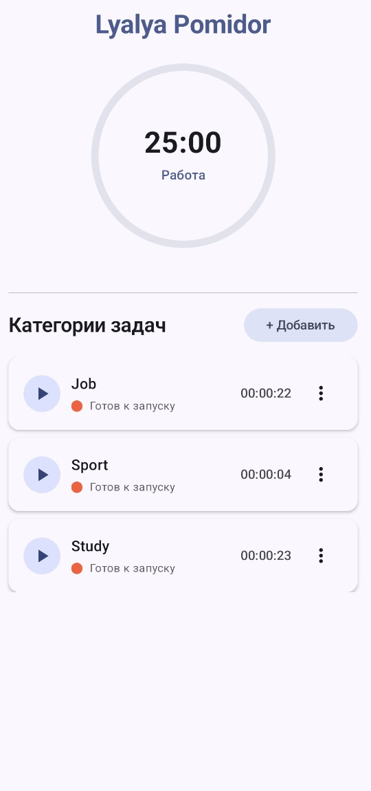
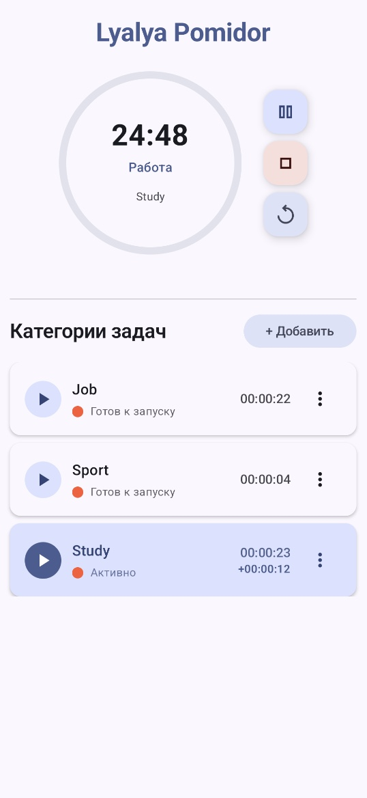
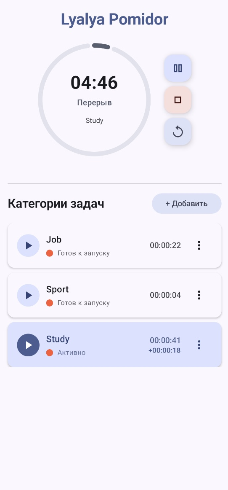

## Lyalya Pomidor Todo

### Описание приложения
**Lyalya Pomidor Todo** — это мобильное приложение для управления временем с использованием техники Pomodoro

|  |  |  |
|---------------------------------|---------------------------------------------|---------------------------------------------|

### 🎯 Основные функции

- 🍅 **Pomodoro таймер**: Классические 25-минутные рабочие сессии с 5-минутными перерывами
- 📊 **Категории задач**: Организация времени по различным активностям
- 💾 **Автоматическое сохранение**: Все сессии сохраняются в базу данных
- ⏱️ **Отслеживание времени**: Общее накопленное время + текущая активная сессия
- 🎨 **Material3 дизайн**: Современный интерфейс с поддержкой темной темы
- ⏯️ **Гибкое управление**: Пауза, остановка, перезапуск таймера
- 🔄 **Реактивный UI**: Автоматическое обновление интерфейса при изменении состояния
- 📱 **Адаптивный дизайн**: Поддержка различных размеров экранов

### Функциональность:

- **🍅 Таймер Pomodoro**
    - Интуитивный круговой таймер с анимированным прогрессом
    - 25 минут рабочего времени + 5 минут перерыва
    - Кнопки управления: пауза, стоп, рестарт
    - Визуальная индикация рабочего времени vs перерыва

- **📝 Управление категориями**
    - Создание и редактирование категорий
    - Цветовая маркировка категорий
    - Простое удаление через диалоги подтверждения
    - Запуск таймера для любой категории одним касанием

- **🎨 Современный дизайн**
    - Material3 дизайн с поддержкой темной/светлой темы
    - Dynamic Colors (адаптация к системной теме на Android 12+)
    - Плавные анимации и переходы между состояниями
    - Edge-to-edge интерфейс для полного использования экрана

### Руководство пользователя

1. **Создание категории**
   - Нажмите кнопку **"+ Добавить"** для создания новой категории
   - Введите название категории в диалоге редактирования

2. **Работа с таймером**
   - Нажмите **▶️** рядом с категорией для запуска 25-минутного таймера
   - Используйте кнопки управления: **⏸️ Пауза**, **⏹️ Стоп**, **🔄 Рестарт**
   - После завершения работы автоматически начинается 5-минутный перерыв
   - Активная категория подсвечивается специальным цветом

3. **Управление категориями**
   - Нажмите **⋮** для открытия меню опций
   - **✏️ Редактировать** - изменить название категории
   - **🗑️ Удалить** - удалить категорию с подтверждением

### Техническое решение

#### 🏗️ Архитектура:
- **Язык**: Kotlin
- **UI Framework**: **Jetpack Compose** (Material3)
- **Архитектура**: MVVM + State Hoisting
- **База данных**: Room (SQLite) 
- **Управление состоянием**: Compose State + LiveData
- **Зависимости**: Gradle + Version Catalog

#### 📦 Современный стек технологий:
```kotlin
// Jetpack Compose BOM для управления версиями
implementation("androidx.compose:compose-bom:2024.12.01")

// Основные Compose компоненты  
implementation("androidx.compose.ui:ui")
implementation("androidx.compose.material3:material3")
implementation("androidx.activity:activity-compose")
implementation("androidx.lifecycle:lifecycle-viewmodel-compose")
```

#### 🔧 Компоненты архитектуры:

**TimerState** - Модель состояния таймера
```kotlin
data class TimerState(
    val timeLeftInMillis: Long,
    val isBreakTime: Boolean,
    val isRunning: Boolean,
    val isPaused: Boolean
) {
    val formattedTime: String // автоматическое форматирование
    val progressPercent: Int // автоматический расчет прогресса
}
```

**PomodoroViewModel** - Управление состоянием
```kotlin
class PomodoroViewModel : AndroidViewModel {
    // Compose State для реактивного UI
    private val _timerState = mutableStateOf(TimerState())
    val timerState: State<TimerState> = _timerState
    
    // Функции управления таймером и категориями
    fun startTimer(category: Category)
    fun togglePauseResume()
    fun stopTimer()
    fun addNewCategory()
}
```

**Compose UI компоненты**
- `TimerComponent` - Круговой таймер с анимированным прогрессом
- `CategoryCard` - Карточка категории с кнопками управления  
- `PomodoroScreen` - Главный экран приложения

#### 📱 База данных:

**Таблица категорий (`category`)**
| Поле    | Тип     | Описание                       |
|---------|---------|--------------------------------|
| id      | Int PK  | Уникальный идентификатор       |
| title   | String  | Название категории             |
| color   | String  | Цвет категории (HEX)           |
| deleted | Boolean | Флаг удаления                  |

### 🚦 Системные требования:
- **Android**: 8.0+ (API 26)
- **Целевая версия**: Android 14 (API 34)
- **Язык**: Kotlin 1.9.23
- **Gradle**: 8.10.2

### 📋 Будущие доработки:
- 📊 **Статистика времени** - отслеживание продуктивности
- 📂 **Добавление задач по категориям** - удобная организация
- 👥 **Учебные группы** - совместная работа с друзьями
- 🎵 **Звуковые уведомления** - настраиваемые сигналы
- 📱 **Виджеты** - быстрый доступ с рабочего стола
