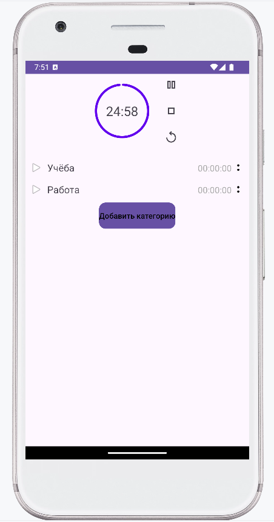

## Lyalya Pomidor Todo

### Описание приложения
Lyalya Pomidor Todo — это мобильное приложение для управления временем с использованием таймера Pomodoro.

### Функциональность:

- **Таймер Pomodoro**
    - Запуск таймера работы (например, 25 минут) с последующими перерывами

- **Отслеживание времени (планируется)**
    - Фиксация времени, проведённого за каждой категорией
    - Отображение статистики за предыдущие дни

### Руководство пользователя

1. Работа таймера 

- При нажатии на кнопку около категории запускается таймер
- После запуска таймера появляются кнопки: пауза, стоп, рестарт
- При нажатии на паузу таймер останавливается, доступны кнопки: старт, стоп, рестарт
- При нажатии на стоп таймер переходит к 5-минутному перерыву, доступны кнопки: старт, стоп, рестарт
- После окончания перерыва таймер возвращается к 25-минутной рабочей сессии

### Описание технического решения

#### Технологии:
- Язык программирования: **Kotlin**
- UI: **XML-разметка**
- Хранение данных: **Room (SQLite)**
- Управление зависимостями: **Gradle**
- Архитектура: **MVVM**

#### База данных:

**Таблица категорий (`category`)**
    - id             | Int (PK)    | Уникальный идентификатор       |
    - title          | String      | Название категории             |
    - color          | String      | Цвет категории                 |
    - deleted        | Boolean     | Удалена ли                     |

### Будущие доработки
- Возможность синхронизации с Google Calendar
- Создание учебных групп и просмотр времени концентрации своих друзей