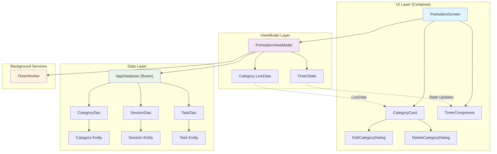

# Архитектурная диаграмма Lyalya Pomidor Todo

Эта диаграмма показывает архитектуру приложения после миграции на Jetpack Compose, включая все слои и их взаимодействие.

## Описание компонентов

### UI Layer (Compose)
- **PomodoroScreen**: Главный экран приложения
- **CategoryCard**: Карточки категорий с управлением
- **TimerComponent**: Круговой таймер с кнопками управления
- **EditCategoryDialog**: Диалог редактирования категории
- **DeleteCategoryDialog**: Диалог подтверждения удаления

### ViewModel Layer
- **PomodoroViewModel**: Основная логика приложения
- **TimerState**: Состояние таймера (время, пауза, прогресс)
- **Category LiveData**: Реактивные данные категорий

### Data Layer
- **AppDatabase**: Room база данных
- **CategoryDao**: Операции с категориями
- **SessionDao**: Операции с сессиями Pomodoro
- **TaskDao**: Операции с задачами
- **Entity классы**: Модели данных для БД

### Background Services
- **TimerWorker**: Фоновая работа таймера 