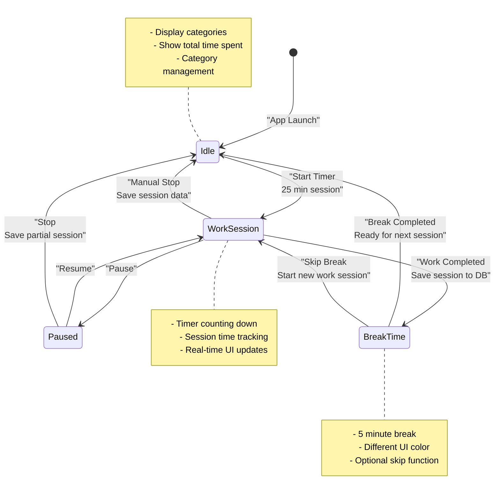

# Диаграмма состояний Pomodoro таймера

Эта диаграмма показывает все возможные состояния таймера Pomodoro и переходы между ними.

## Описание состояний

### Idle (Покой)
- Начальное состояние приложения
- Отображение списка категорий
- Показ общего накопленного времени
- Управление категориями (создание, редактирование, удаление)

### WorkSession (Рабочая сессия)
- Активный 25-минутный таймер
- Обратный отсчет времени
- Отслеживание времени текущей сессии
- Возможность поставить на паузу или остановить

### Paused (Пауза)
- Таймер приостановлен
- Время не тикает
- Возможность возобновить или остановить
- Сохранение промежуточного состояния

### BreakTime (Перерыв)
- 5-минутный перерыв после завершения работы
- Другой цвет интерфейса
- Автоматический переход в Idle после завершения
- Возможность пропустить перерыв

## Переходы между состояниями

1. **Start Timer**: Idle → WorkSession
2. **Pause**: WorkSession → Paused  
3. **Resume**: Paused → WorkSession
4. **Work Complete**: WorkSession → BreakTime
5. **Stop (from Work)**: WorkSession → Idle
6. **Stop (from Pause)**: Paused → Idle
7. **Break Complete**: BreakTime → Idle
8. **Skip Break**: BreakTime → WordSession

## Сохранение данных

- **При завершении работы**: Сессия сохраняется в базу данных
- **При остановке**: Частичная сессия сохраняется
- **Накопление времени**: Общее время категории обновляется 